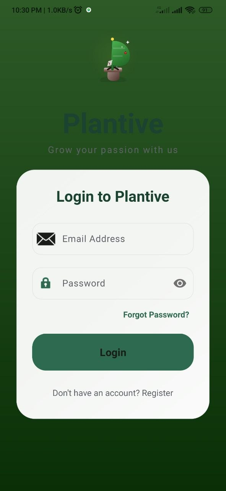
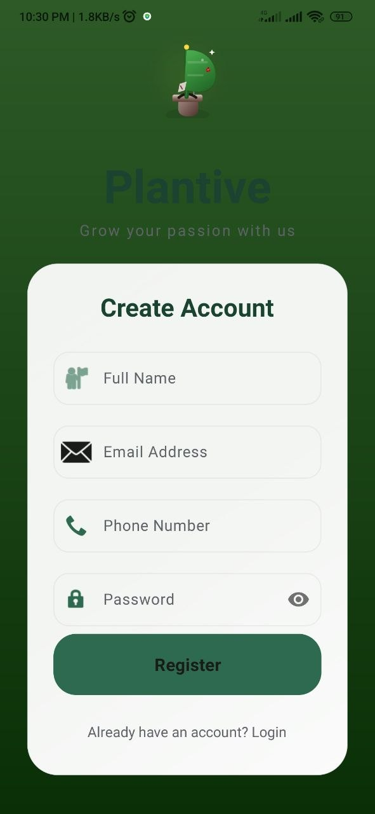
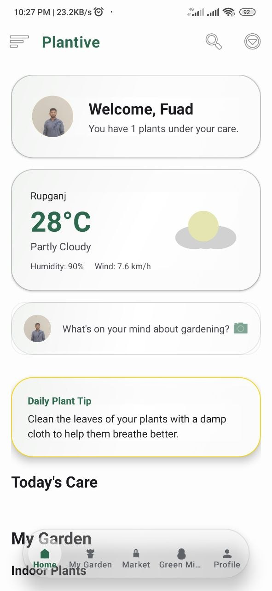
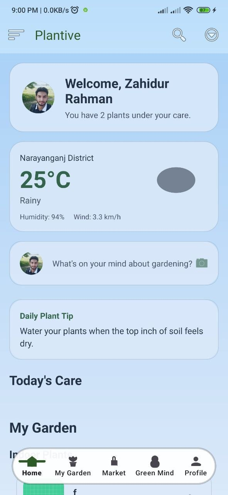
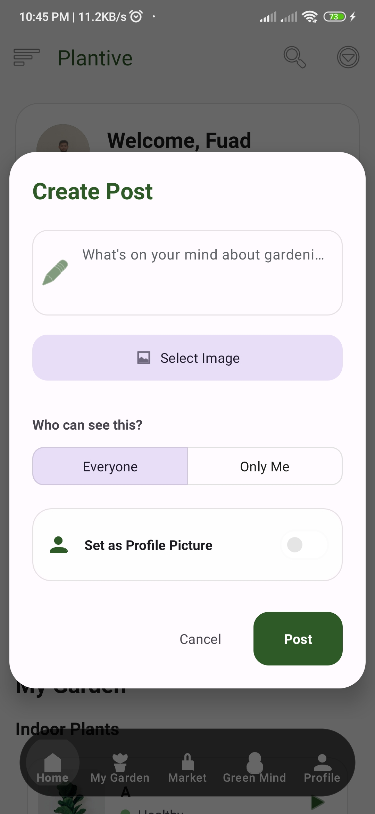
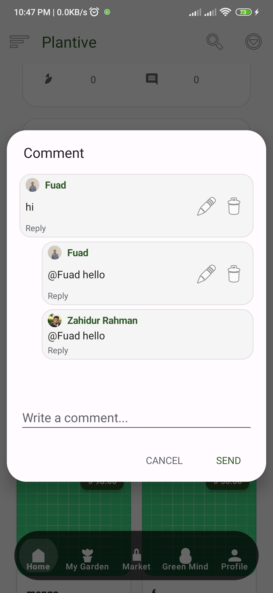
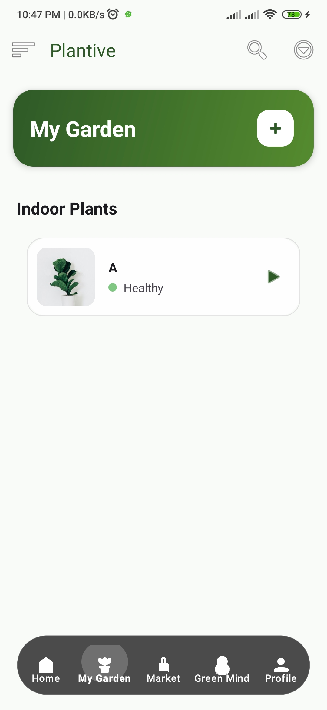
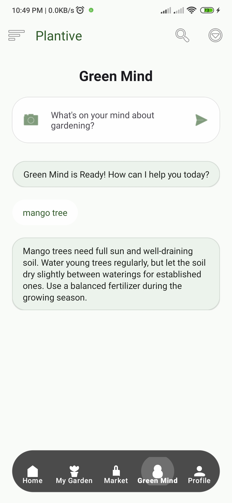

<div align="center">

# 🌿 Plantive
### **The Ultimate AI-Powered Smart Gardening Ecosystem**

[](https://developer.android.com)
[](https://www.oracle.com/java/)
[](https://firebase.google.com/)
[](https://deepmind.google/technologies/gemini/)
[](https://opensource.org/licenses/MIT)

**Empowering gardeners with cutting-edge AI, a thriving marketplace, and a global community.**

---

[Explore Features](#-core-project-sections) • [Project Structure](#-project-structure) • [Tech Stack](#-tech-stack)

</div>

---

## 📖 Overview
**Plantive** is more than just a gardening app; it's a complete intelligent care system. Developed with precision at **Green University of Bangladesh**, it bridges the gap between technology and nature. Using **Google Gemini AI**, Plantive can diagnose plant diseases in seconds, while the integrated marketplace and community platform foster a sustainable green economy.

---

## ✨ Key Features
- 🤖 **AI Disease Diagnosis:** Instant plant health checks powered by Google Gemini.
- 🛒 **P2P Marketplace:** Buy and sell rare plants securely.
- 👨‍🌾 **Community Hub:** Share posts, tips, and connect with other gardeners.
- 🏠 **Smart Dashboard:** Weather-adaptive UI with daily care reminders.
- 🛡️ **Admin Panel:** Comprehensive management of users, sellers, and system health.
- 🗺️ **Interactive Maps:** Locate local nurseries and sellers using OpenStreetMap.

---

## 📁 Project Structure

The ecosystem is split into two primary Android applications:

### 🌿 1. Plantive (User App)
The main interface for gardeners, providing AI tools and social features.
```text
Plantive/app/src/main/java/com/plantive/softece/
├── 🤖 ai/           # Gemini AI integration & disease diagnosis
├── 🛒 market/       # P2P Marketplace, cart, and order tracking
├── 👨‍🌾 community/    # Social hub, post creation, and comments
├── 🌱 garden/        # Plant collection & health logging
├── 🏠 home/         # Weather-adaptive dashboard & care tasks
├── 👤 Profile/      # User account & settings management
└── 🛠️ utils/        # Firebase helpers & shared components
```

### 🛡️ 2. Admin (Management App)
The control center used to moderate the platform and verify transactions.
```text
Admin/app/src/main/java/com/plantive/softece/admin/
├── 👥 User/         # User database management
├── 🏬 Seller/       # Seller profiles & verification
├── 📦 SellRequest/  # Marketplace moderation & approvals
├── 🔑 AdminLogin/   # Secure administrative access
└── 📊 Dashboard/    # System analytics & health monitoring
```

---

## 🏗️ Core Project Sections

### 🛡️ 1. Admin Control Center
*The nerve center for system-wide management and verification.*
<p align="center">
 
  
  
  
 </p>

---

### 🔑 2. Secure Access Flow
*A seamless, secure authentication experience for all users.*
<p align="center">
  
  
  
</p>

---

### 🏠 3. Intelligent Dashboard
*Dynamic home screen featuring weather-adaptive UI and daily care tasks.*
<p align="center">
  
  
</p>

---

### 📊 4. Seller Performance Engine
*Empowering local businesses with sales tracking and inventory management.*
<p align="center">
  
</p>

---

### 👨‍🌾 5. Global Community Hub
*Connect with experts, share your journey, and grow together.*
<p align="center">
  
  
</p>

---

### 🛒 6. Plantive Marketplace
*A secure, peer-to-peer e-commerce platform for rare and local plants.*
<p align="center">
  
</p>

---

### 🌱 7. Garden & Care Records
*Visualize your growth and maintain precise health logs for your collection.*
<p align="center">
  
  
  
</p>

---

### 🤖 8. AI Plant Assistant
*Advanced disease recognition and smart care advice powered by Gemini.*
<p align="center">
  
</p>

---

### 📜 9. Order History
*Full transparency and tracking for every transaction and care activity.*
<p align="center">
  
</p>

---

## 🛠️ Tech Stack

| Layer | Technology |
| :--- | :--- |
| **Languages** | Java (JDK 17) |
| **Backend** | Firebase (Real-time DB, Auth, Firestore, Storage, Cloud Messaging) |
| **AI Engine** | Google Gemini API (`generativeai:0.9.0`) |
| **Maps** | OpenStreetMap (osmdroid) |
| **UI/UX** | Material Design 3, Lottie Animations, Facebook Shimmer |
| **Image Loading** | Glide |
| **Analytics** | MPAndroidChart (Admin app) |
| **Architecture** | MVC with WorkManager for background tasks |

---

## 📄 License
Distributed under the MIT License. See `LICENSE` for more information.

<div align="center">

**Developed with ❤️ by Team Softece**  
*Integrated Design Project | Green University of Bangladesh*

</div>